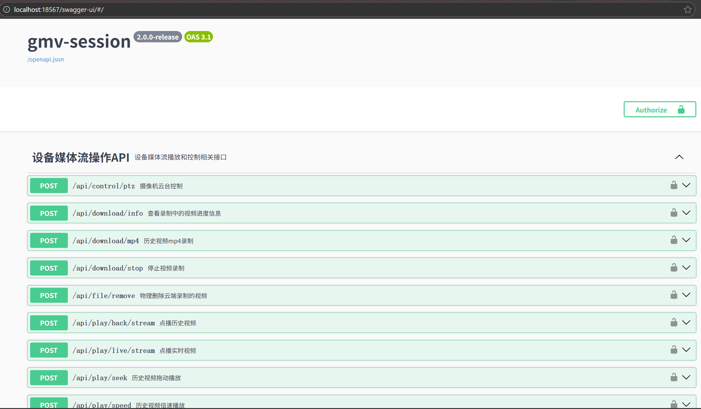
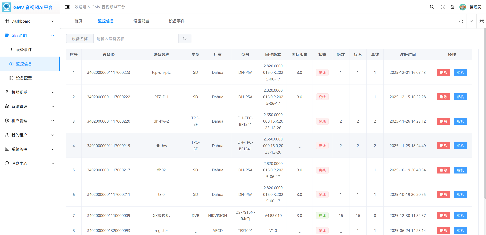
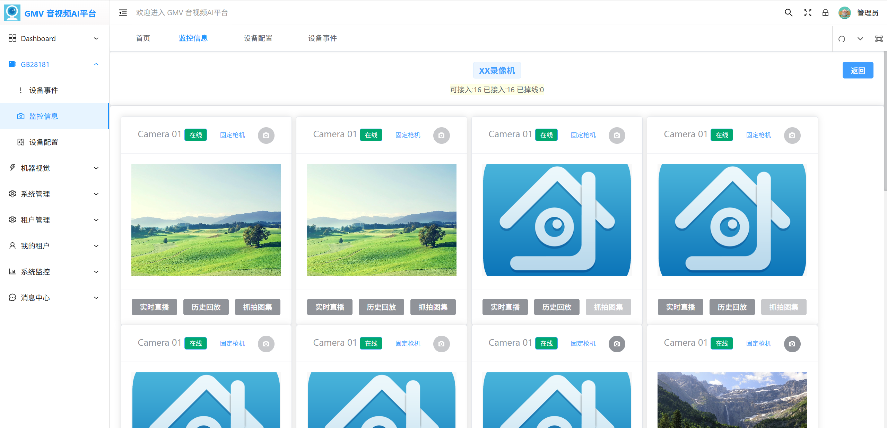
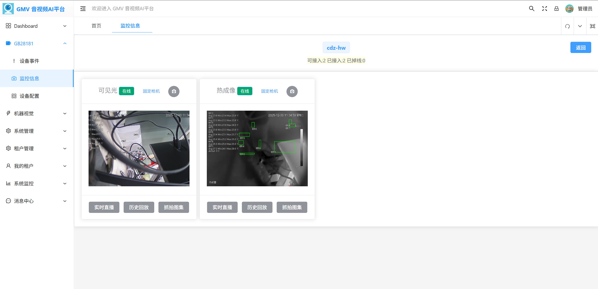
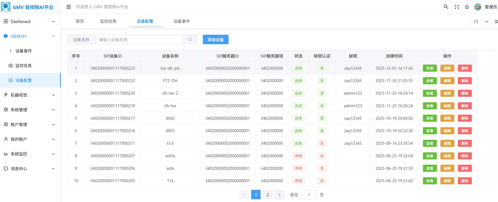
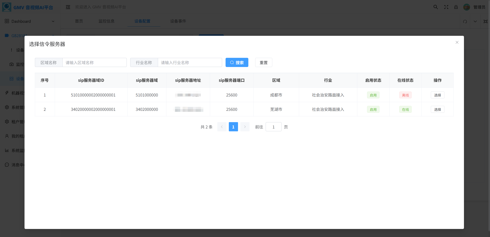
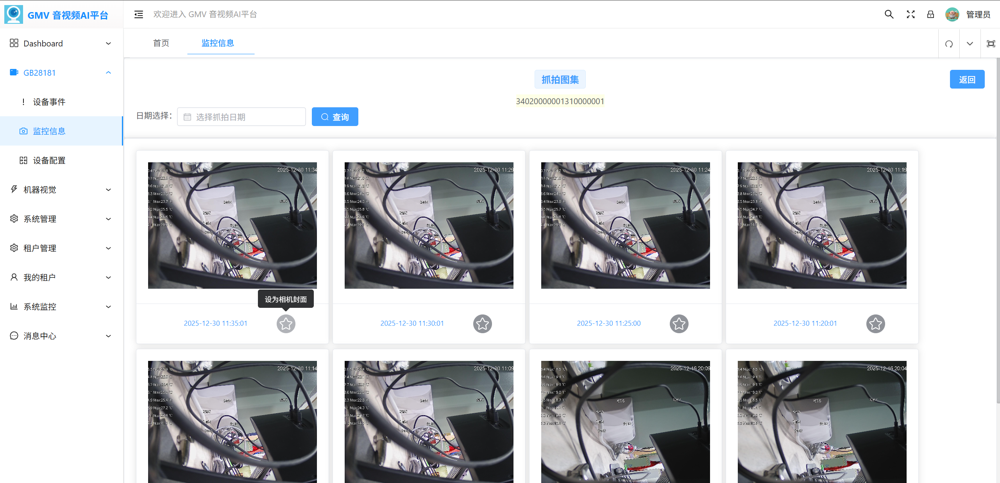
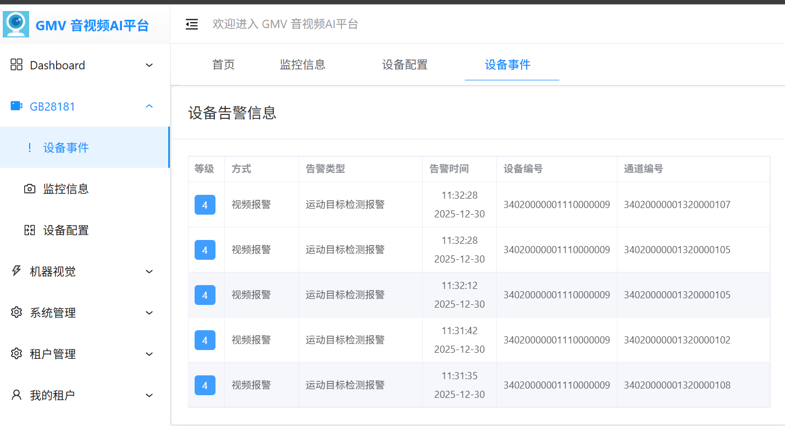
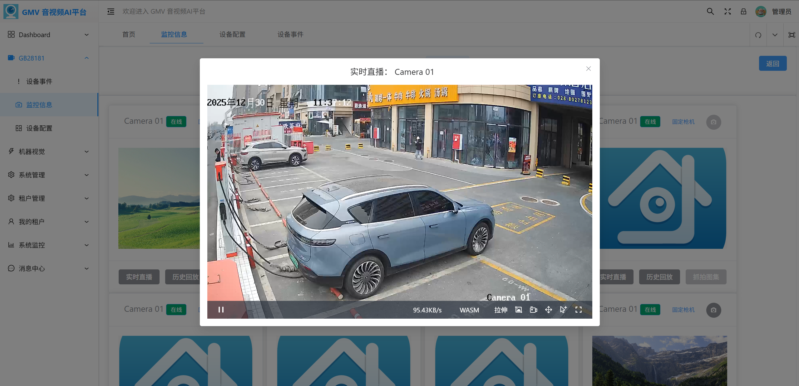
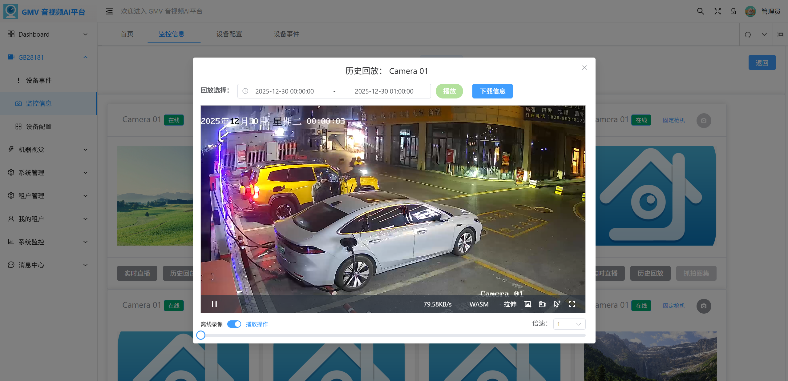

# 这是一个基于GB28181的视频监控实现：兼容2016、2022版本。采用纯RUST语言编码，高效、安全、无惧并发；设备与用户端到端打通、闭环信令服务、流媒体服务。


## 🌟 TCP/UDP端口复用、单机/集群部署、SWAGGER接口文档、不做破坏性更新【接口稳定】、开箱即用【无需编译链接各种依赖】
## 文档地址：
[2.0-release](https://github.com/epimore/gmv/wiki/%E6%96%87%E6%A1%A3%E7%89%88%E6%9C%AC:-2.0.0%E2%80%90release)

### 🔗 1. 前端场景界面 demo（VUE 项目）：[gmv-vision](https://github.com/epimore/gmv-vision)
- 注意：此为微前端构建，可参考接口调用
### 🔗 2. 自定义业务场景 demo（JAVA 项目）：[gmv-java](https://github.com/epimore/epimore-gmv)
- 注意：此为后端微服务构建，可参考接口调用
- 
### ✨✨✨ 在线测试地址：[epimore.cn](https://epimore.cn)

## GMV:SESSION 信令服务已实现：
1. 设备注册、注销、心跳、状态（在线/离线）
2. 设备（子设备）信息、点播/历史回播/视频下载
3. 自动管理流：流注册超时、无人观看、响应超时等自动关闭流
4. 根据cron表达式配置自动采集抓拍实时图像
5. 解析设备告警及推送
6. ...

## GMV:STREAM 流媒体服务已实现
```text
RTP -> PS -> H264 -> HTTP-FLV（直/点播）、MP4（录像）
    -> H264 -> HTTP-FLV（直/点播）、MP4（录像）
    ...
```

### v1/V2版本：完成。
1. 实时播放 - 完成
2. 历史回放 - 完成
   1. 倍数播放 - 完成
   2. 拖动播放 - 完成
3. 云台控制 - 完成
   1. 转向 - 完成
   2. 焦距调整 - 完成
4. 告警推送 - 完成
5. 定时抓拍 - 完成
6. 图片上传 - 完成
7. 视频离线下载 - 完成

### v2版本
#### 已重构完成v1内容，鲁棒性与扩展性更强；将持续维护及按需新增功能

## TODO:
### V3版本：预计25年底启动
1. 按需推流
2. 图片AI识别-插件化业务场景
3. 多数据库配置














## 微信交流添加：epimore;备注GMV