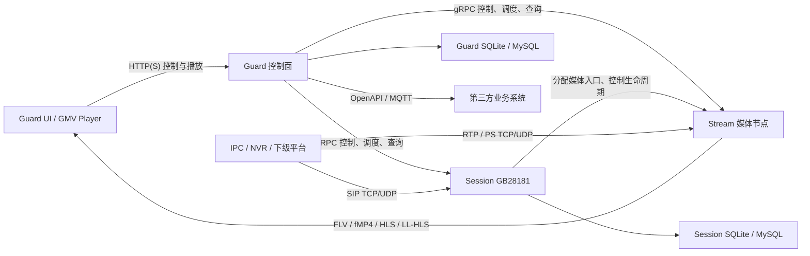

# GMV

GMV 是一个使用 Rust 构建的 GB28181 边缘视频监控与媒体平台，兼容 GB/T 28181-2016、GB/T 28181-2022。当前版本以 Guard Web UI 为统一入口，已经贯通设备接入、实时预览、历史回放、云端录像、语音广播、媒体输出、运行监控和第三方集成。

当前工作区版本：`2.2.0-release`。

> 当前可交付版本定位为“GB28181 边缘媒体预览”。ONVIF、智能分析、告警与事件仍属于实验或后续闭环能力，不应与当前稳定交付范围混淆。

## 从 UI 开始

完成部署后访问：

```text
http://<Guard-IP>:8080/
```

使用 `guard/server/config.yml` 中首次启动配置的管理员账号登录。首次登录后应立即修改密码，并从配置中移除或清空 bootstrap 初始密码。

UI 的推荐使用路径：

1. 在 **Dashboard** 查看系统整体状态、边端能力和待处理事项。
2. 在 **系统管理 / 系统健康** 确认 Guard、Session、Stream 节点在线，地址和负载正常。
3. 在 **GB28181 / 注册管理** 新增或维护设备注册配置。
4. 将摄像机或下级平台的 SIP 服务地址指向 Session 配置的 `lan_ip:lan_port`，等待设备注册上线。
5. 在 **GB28181 / 监控信息** 选择设备和通道，发起直播、回放、抓拍、云台或语音广播。
6. 在 **流媒监控** 查看活动流、历史流、输出格式和观看人数，必要时执行受控停止。
7. 在 **第三方集成** 配置单一业务应用的 HTTP 或 MQTT 接入、凭证、映射、审计和投递重试。

## 当前能力

### Guard 控制面与 Web UI

- Dashboard、节点健康、主机 CPU/内存/磁盘/网络指标、业务负载和运行诊断。
- Session、Stream、Avai 节点注册、心跳、调度、租约和运行路由管理。
- `viewer`、`operator`、`admin` 角色，Session Cookie、CSRF 防护、用户启停、有效期和密码维护。
- Guard UI 与 GMV Player 一体化构建，可由 Guard 托管静态文件，也可使用 `embed-ui` 嵌入单个二进制交付。
- `/health/live`、`/health/ready`、`/metrics` 运维入口。
- HTTP OpenAPI、MQTT AsyncAPI 和离线契约导出。

### GB28181 信令与设备管理

- 设备注册、注销、心跳、在线/离线状态和 Catalog 资源同步。
- 设备、通道、业务能力、资源类型和业务归属配置。
- 实时直播、历史录像查询与回放、云端录像任务、抓拍图集和通道封面。
- 云台方向、变倍、聚焦控制。
- 单通道和多通道语音广播，支持按资源能力判断可用性和独立停止目标。
- SIP 与媒体传输支持 TCP/UDP；Session 负责信令事实和生命周期，Stream 负责 RTP/PS 数据面。

### 播放与媒体输出

- 单画面与多画面直播、回放；多画面在 HTTP/1.1 下最多 6 路，经验证的 HTTPS + HTTP/2 环境最多 16 路。
- 直播主/辅码流选择与运行中 make-before-break 切换，失败时保留原画面。
- HTTP-FLV、HTTP-fMP4、HLS-fMP4、LL-HLS-fMP4 输出；完成态云端录像使用 MP4。
- H.264/H.265 视频原样转封装，不做视频转码；H.265 最终能否播放取决于浏览器和操作系统解码能力。
- AAC 参数完整时直通；G.711A/U、G.723.1、G.729 归一化为 AAC-LC；异常或迟到音频不阻断已就绪视频。
- 直播本地暂停/继续；设备回放支持远端暂停/继续、Seek 和 `0.5x/1x/2x/4x` 倍速。
- 播放中按画面切换输出格式；新格式就绪并开始播放后才释放旧输出。
- 相同 Session、设备、通道和直播码流档位共享一条输入流水线，不因新增观看者重复 INVITE。
- 播放 URL 使用短期 token；播放器关闭只释放当前订阅，不影响其他观看者。

### 云端录像与抓拍

- 从历史录像时段创建 MP4 云端录像任务，支持查看进度、停止、播放、下载和删除。
- 完成文件由 Session 直接提供短期 ticket 和单段 Range 访问，Stream 下线不影响已完成文件。
- 设备抓拍、图片列表、短期访问地址和通道封面设置。

### 第三方业务接入

- 一个部署只管理一个业务接入应用，可选择 HTTP 或 MQTT 作为接入方式。
- HTTP HMAC 签名、请求 ID 幂等、Nonce 重放防护、回调地址策略和投递重试。
- MQTT v3/v5、运行期配置、command/result、事件 topic、QoS 1、最小权限 scope。
- integration 主密钥、凭证创建/吊销/受控查看、映射、审计、outbox 和 dead-letter 重试。
- 在线契约入口：`/api-docs`、`/api-docs/http`、`/api-docs/mqtt`。

## 系统架构


```mermaid
flowchart LR
    Browser["Guard UI / GMV Player"] -->|"HTTP(S) 控制与播放"| Guard["Guard 控制面"]
    Guard -->|"gRPC 控制、调度、查询"| Session["Session GB28181"]
    Guard -->|"gRPC 控制、调度、查询"| Stream["Stream 媒体节点"]
    Device["IPC / NVR / 下级平台"] -->|"SIP TCP/UDP"| Session
    Session -->|"分配媒体入口、控制生命周期"| Stream
    Device -->|"RTP / PS TCP/UDP"| Stream
    Stream -->|"FLV / fMP4 / HLS / LL-HLS"| Browser
    Guard --> GuardDB["Guard SQLite / MySQL"]
    Session --> SessionDB["Session SQLite / MySQL"]
    Guard -->|"OpenAPI / MQTT"| Business["第三方业务系统"]
```

Guard 是控制面、管理入口和 UI 聚合层，不代理 RTP、音视频帧或录像文件。Session、Stream 分别持有信令和媒体资源事实；Guard 短暂不可用不会中断已经建立的 SIP dialog 和媒体流水线。

## 组件

| 组件 | 路径 | 交付物 | 职责 |
| --- | --- | --- | --- |
| Guard Server | `guard/server` | `gmv-guard-server` | 控制面、认证、UI、API、调度、第三方集成 |
| Guard UI | `guard/ui` | `dist/` 或嵌入 Guard | Vue 3 + Element Plus 管理控制台 |
| GMV Player | `guard/player` | 由 Guard UI 引入 | FLV、fMP4、HLS、LL-HLS、MP4 播放与控制 |
| GB28181 Session | `session/gb28181` | `gmv-session-gb28181` | SIP、设备/通道、回放、抓拍、广播和录像任务 |
| Stream | `stream` | `gmv-stream` | RTP/PS 接入、解封装、音频归一化和媒体输出 |
| Avai | `avai` | `avai` | 智能分析执行节点；当前 UI 入口为实验能力 |
| Shared | `shared/*` | Rust crates / protobuf | 跨服务协议、领域模型和节点通用能力 |

## 本地端到端启动

以下流程面向 Linux/WSL2 源码开发环境。生产和离线交付请直接参考 [PACKAGING_DEPLOYMENT.md](PACKAGING_DEPLOYMENT.md)。

### 1. 准备目录与工具链

源码依赖以下 sibling 目录关系：

```text
epimore/
├── gmv/
├── gmv_pjsip/
└── pigs/
```

构建机需要 Rust/Cargo、Node.js、pnpm、clang/gcc、make、pkg-config、curl 和 tar。

首次构建原生依赖：

```bash
cd /path/to/epimore/gmv
./scripts/bootstrap_dev.sh
```

该脚本构建仓库固定的 FFmpeg 6.1、PJSIP 2.17，并执行 `cargo fetch`。生成的 `dist/` 属于本机构建产物，不应提交。

### 2. 构建 UI 和三项核心服务

```bash
pnpm -C guard/ui install --frozen-lockfile
pnpm -C guard/ui build

source ./stream/env_ffmpeg.sh
cargo build -p gmv-guard-server --release --features embed-ui
cargo build -p gmv-session-gb28181 --release
cargo build -p gmv-stream --release
```

`embed-ui` 会把已构建的 `guard/ui/dist` 嵌入 Guard 二进制。开发时也可以不启用该 feature，由 Guard 读取 `guard.http.ui_dist_dir`。

### 3. 配置单机环境

修改以下文件：

- `guard/server/config.yml`
- `session/gb28181/config.yml`
- `stream/config.yml`

至少核对这些配置：

| 配置 | 要求 |
| --- | --- |
| Guard HTTP | `guard.http.bind_addr`、浏览器来源 `origins` |
| Guard gRPC | `guard.grpc.bind_addr`，必须能被 Session/Stream 访问 |
| 节点白名单 | Session `domain_id`、Stream `name` 与 `allowed_nodes` 完全一致 |
| Session SIP | `lan_ip` 必须是设备可达网卡 IP；核对 `lan_port`、`wan_ip`、`wan_port` |
| Session 对外地址 | 核对 HTTP `public_url` 和 gRPC `advertised_url` |
| Stream 媒体入口 | 核对 `listen_ip`、设备可达的 `advertised_host` 和 RTP 端口/端口池 |
| Stream 对外地址 | 核对 HTTP `public_url` 和 gRPC `advertised_url` |
| 数据库 | Guard 与 Session 分别选择 `sqlite` 或 `mysql`，不要共用错误的事实表 |
| 存储 | Guard 数据、Session 抓拍和云端录像目录必须存在且可写 |
| 初始管理员 | 仅空库首次启动使用；部署前设置强密码，初始化后清理配置 |

无外部数据库的单机验证可以让 Guard 和 Session 都选择 SQLite。生产环境必须把示例地址、密码、证书和存储路径替换为现场值。

### 4. 按顺序启动

分别在三个终端运行：

```bash
target/release/gmv-guard-server start -c guard/server/config.yml
```

```bash
target/release/gmv-stream start -c stream/config.yml
```

```bash
target/release/gmv-session-gb28181 start -c session/gb28181/config.yml
```

需要后台运行时为 `start` 增加 `--daemon`。推荐顺序是 Guard → Stream → Session。

### 5. 健康检查与 UI 验收

```bash
curl http://127.0.0.1:8080/health/live
curl http://127.0.0.1:8080/health/ready
```

然后打开 `http://127.0.0.1:8080/`，完成以下最小闭环：

- 登录并修改管理员密码。
- 在系统健康页看到一个 `SESSION-GB28181` 和一个 `STREAM` 节点在线。
- 在注册管理页创建或核对设备配置，并让设备注册上线。
- 在监控信息页看到 Catalog 通道，完成一次实时直播。
- 查询一段设备录像并完成回放；按需验证暂停、Seek、倍速或云端录像。
- 关闭播放器后，在流媒监控页确认对应订阅和输出按生命周期释放。

## 端口与网络

默认示例端口如下，最终以配置文件为准：

| 端口 | 服务 | 用途 |
| ---: | --- | --- |
| `8080/TCP` | Guard | Web UI、HTTP API、健康检查 |
| `18080/TCP` | Guard | 内部 gRPC 控制面 |
| `35600/TCP+UDP` | Session | GB28181 SIP |
| `28567/TCP` | Session | 图片、录像与节点 HTTP |
| `19081/TCP` | Session | 节点 control gRPC |
| `28568/TCP+UDP` | Stream | 单端口 RTP/PS 媒体入口 |
| `28570/TCP` | Stream | 播放输出与节点 HTTP |
| `19082/TCP` | Stream | 节点 control gRPC |

多端口媒体模式需要开放 `stream/config.yml` 中配置的完整 TCP/UDP 端口范围。跨主机部署时，`bind/listen` 地址与 `advertised/public` 地址必须分别表达“本机监听”和“其他节点/浏览器实际可达”。

## API 与集成文档

Guard 运行后提供：

| 地址 | 内容 |
| --- | --- |
| `/api-docs` | 第三方接入总览 |
| `/api-docs/http` | HTTP OpenAPI 文档 |
| `/api-docs/mqtt` | MQTT AsyncAPI 文档 |
| `/api-docs/openapi.json` | OpenAPI 3.1 契约 |
| `/api-docs/asyncapi.json` | AsyncAPI 契约 |
| `/metrics` | Prometheus 风格指标 |

离线导出契约：

```bash
target/release/gmv-guard-server export-integration-contracts ./contracts
```

## 开发验证

后端最小检查：

```bash
cargo check -p gmv-protocol
cargo check -p gmv-guard-server
cargo check -p gmv-session-gb28181
cargo check -p gmv-stream
```

UI 与播放器：

```bash
pnpm -C guard/player typecheck
pnpm -C guard/player test
pnpm -C guard/player build
pnpm -C guard/ui typecheck
pnpm -C guard/ui build
pnpm -C guard/ui test:e2e
```

数据库相关改动不能只以编译通过作为结论；涉及查询返回类型、schema 或配置时，需要分别验证 MySQL、SQLite feature，并在真实双后端执行存储契约测试。

## 当前边界

- 默认稳定菜单为 Dashboard、GB28181 注册管理、GB28181 监控信息、流媒监控、第三方集成、系统健康和用户管理。
- ONVIF 当前为占位；智能分析、告警与事件默认实验隐藏，不属于本次稳定交付承诺。
- 节点、租约、运行路由和事件当前由 Guard 进程内状态承载；Guard 数据库持久化用户、第三方接入、凭证、配置、审计、outbox 和 command。
- 节点 gRPC 服务凭证尚未闭环。生产部署应使用受控内网或 TLS、限制 `/metrics`、保护配置文件和私钥。
- H.265 服务端支持转封装，但浏览器播放能力需要按目标浏览器、操作系统和实际码流现场验证。
- AAC、G.711A/U、G.723.1、G.729 已有自动化媒体 fixture；真实设备音频兼容性仍应纳入交付验收。
- 真实 MQTT Broker、外部 HTTP callback、物理 GB28181 设备、NAT、防火墙、证书和存储性能必须在目标环境完成最终验收。

## 生产交付

生产打包、内嵌/分离 UI、SQLite/MySQL 裁剪、Nginx TLS、systemd、跨平台构建、持久化目录、升级回滚和发布检查清单见 [PACKAGING_DEPLOYMENT.md](PACKAGING_DEPLOYMENT.md)。

## License

[MIT](LICENSE)
