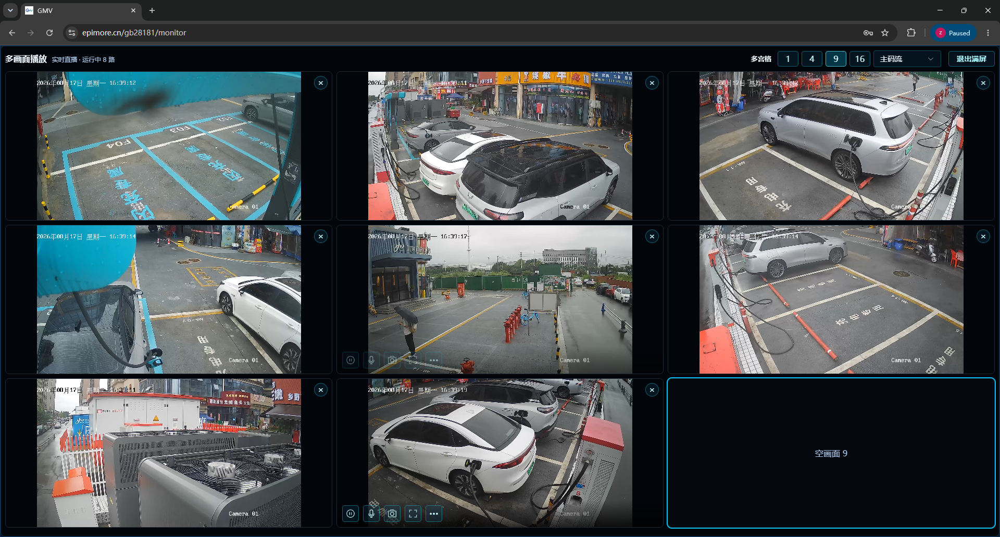
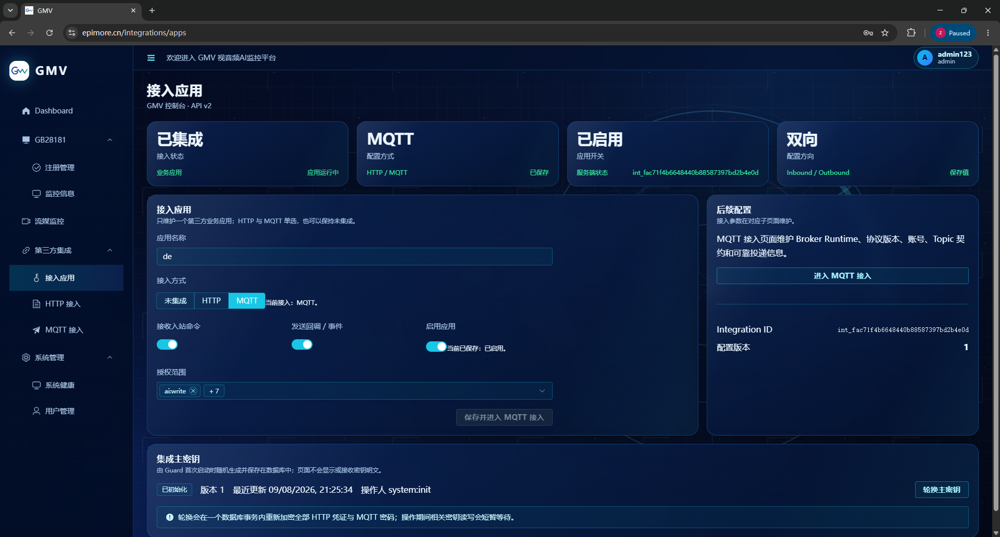
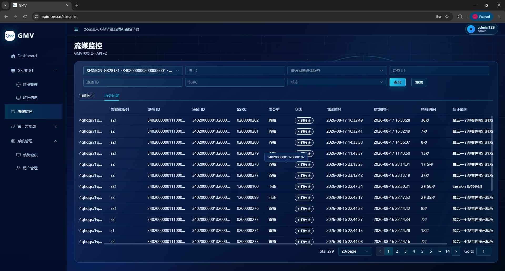
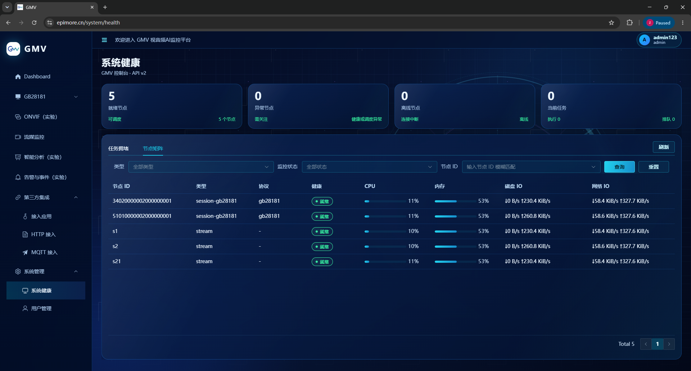

# GMV

**GMV — Guard · Media · Vision**

GMV 是一个使用 **Rust** 构建的智能视音频基础设施，从设备接入、媒体处理、流媒体分发、视觉分析、数据媒体展示，到灵活部署 **边缘端、中心端、云端**，以完成端到端交付。

目标是在较低计算、存储与网络成本下，将海量视音频数据转化为可消费的媒体与结构化智能信息。

> **Connect · Stream · Understand**
>
> 连接设备，处理媒体，理解世界。
> - 演示地址：https://epimore.cn






GMV 由四类核心能力组成：

- **Guard**：统一管理、调度、鉴权与对外 API
- **Session**：设备接入、协议会话与信令交互
- **Stream**：高性能媒体接收、处理、转封装与分发
- **Vision**：视觉感知、AI 推理、跟踪与事件分析

---

# 架构

GMV 采用 **Control Plane / Work Plane** 分离架构。

- **Control Plane**：Guard
- **Work Plane**：Session / Stream / Vision

```text
                         Third Party / Web / App
                                  │
                         HTTP / MQTT / API
                                  │
                                  ▼
                    ┌───────────────────────────┐
                    │           Guard           │
                    │                           │
                    │ API / Auth / Tenant       │
                    │ Device / Node / Task      │
                    │ Scheduler / Cluster       │
                    │ State / Event / Metadata  │
                    └─────────────┬─────────────┘
                                  │
                       schedule / control / state
                                  │
               ┌──────────────────┼──────────────────┐
               │                  │                  │
               ▼                  ▼                  ▼
        ┌─────────────┐    ┌─────────────┐    ┌─────────────┐
        │   Session   │    │   Stream    │    │   Vision    │
        │   Cluster   │    │   Cluster   │    │   Cluster   │
        │             │    │             │    │             │
        │ GB28181     │    │ RTP / PS    │    │ Detector    │
        │ SIP         │    │ Demux       │    │ Tracker     │
        │ ONVIF       │    │ Remux       │    │ Pose / OCR  │
        │ Device IO   │    │ Transcode   │    │ VLM / Event │
        └──────┬──────┘    └──────┬──────┘    └──────┬──────┘
               │                  │                  │
               └──────────────────┼──────────────────┘
                                  │
                           direct data flow
```

Guard 负责统一调度、状态管理与外部交互。

Session、Stream、Vision 任务建立后可直接交互，Guard 不参与高频媒体数据转发。

---

# 协议与能力

## Guard · 守卫

统一控制面，负责平台管理、节点调度与业务集成。

### 已实现

- Web 管理控制台
- Player 播放器多平台适配封装
- 用户、认证与权限
- Session / Stream / Vision 节点注册与心跳
- 节点状态、资源与健康监控
- 任务与资源调度
- HTTP API / OpenAPI
- MQTT
- SQLite / MySQL
- Metrics / Health Check

### 规划

- 集群高可用
- CPU / GPU / NPU 算力调度
- AI 模型管理
- AI 任务管理
- 边缘节点统一管理

---

## Session · 信令

负责设备接入、协议交互与媒体会话控制。

### 已实现

#### GB28181

- GB/T 28181-2016 / 2022
- SIP UDP / TCP
- 注册、认证与心跳
- 设备与通道目录
- 实时点播
- 历史录像查询与回放
- Seek / 暂停 / 倍速
- PTZ
- 抓拍
- 语音广播
- 告警基础能力
- 云端录像协调

### 规划

- ONVIF
- GB28181 级联增强
- TLS / SRTP
- 更多设备与厂商兼容

---

## Stream · 流媒体

负责高并发媒体数据处理与分发。

### 已实现

#### 输入与媒体处理

- RTP UDP / TCP
- MPEG-PS
- H.264 / H.265
- AAC
- G.711A / G.711U
- G.723.1 / G.729
- 音视频时间轴处理
- 音频统一转 AAC

#### 输出

- HTTP-FLV
- HTTP-fMP4
- HLS-fMP4
- LL-HLS-fMP4
- MP4

#### 播放能力

- 实时直播
- 历史回放
- 多画面
- Seek
- 暂停 / 恢复
- 倍速播放
- 主辅码流切换
- 媒体输入复用

### 规划

- RTSP
- WebRTC
- DASH / CMAF
- QUIC
- 硬件编解码
- GPU / NPU Zero-Copy
- AI Frame Broker

---

## Vision · 视觉智能

负责将视频和图片转化为可计算、可理解、可持续演进的结构化视觉信息。

> **让计算尽可能靠近数据，让真正有价值的信息流向云端。**

总体能力链路：

```text
Video / Image
      ↓
Frame Broker
      ↓
Multi-Model Runtime
      ↓
Detection / Pose / OCR / Segmentation
      ↓
Tracker / Temporal Analysis
      ↓
Business Event
      ↓
Edge / Cloud
      ↓
Training Feedback
      ↓
Model Evolution
```

### 规划能力

- 视频感知入口与 Frame Broker
- 多 AI 服务订阅
- KeyFrame / Fixed FPS / Adaptive 按需抽帧
- 分辨率与 Frame Variant 复用
- ONNX 模型标准
- YOLO / OCR / Pose / Segmentation
- ONNX Runtime / OpenVINO / TensorRT / RKNN
- CPU / GPU / NPU 推理
- 多模型协同
- Tracker 与时序分析
- 业务事件引擎
- 边缘 AI / 云端 AI
- 模型管理
- 灰度发布与 OTA
- Active Learning
- 边云训练反馈
- 模型持续演进

> **以尽可能低的计算、存储与网络成本，将海量视音频媒体转换为有效信息，并在边缘、云端与训练平台之间形成持续演进的数据闭环。**

---

# 功能矩阵

状态：

```text
✅ 已实现
🚧 规划 / 建设中
```

| 能力 | Guard | Session | Stream | Vision |
|---|:---:|:---:|:---:|:---:|
| Web 管理 | ✅ |  |  |  |
| 用户 / 权限 | ✅ |  |  |  |
| 节点管理 | ✅ | ✅ | ✅ | ✅ |
| 集群调度 | ✅ | ✅ | ✅ | 🚧 |
| GB28181 |  | ✅ | ✅ |  |
| ONVIF |  | 🚧 |  |  |
| SIP |  | ✅ |  |  |
| RTP |  |  | ✅ |  |
| H.264 / H.265 |  |  | ✅ |  |
| 实时直播 | ✅ | ✅ | ✅ |  |
| 历史回放 | ✅ | ✅ | ✅ |  |
| PTZ | ✅ | ✅ |  |  |
| 抓拍 | ✅ | ✅ | ✅ |  |
| 语音广播 | ✅ | ✅ | ✅ |  |
| HTTP-FLV |  |  | ✅ |  |
| HTTP-fMP4 |  |  | ✅ |  |
| HLS / LL-HLS |  |  | ✅ |  |
| MP4 |  |  | ✅ |  |
| RTSP |  |  | 🚧 |  |
| WebRTC |  |  | 🚧 |  |
| DASH / CMAF |  |  | 🚧 |  |
| QUIC |  |  | 🚧 |  |
| Frame Broker |  |  | 🚧 | 🚧 |
| 多 AI 订阅 |  |  | 🚧 | 🚧 |
| KeyFrame AI |  |  | 🚧 | 🚧 |
| Adaptive Sampling |  |  | 🚧 | 🚧 |
| ONNX |  |  |  | 🚧 |
| YOLO |  |  |  | 🚧 |
| OCR |  |  |  | 🚧 |
| Pose |  |  |  | 🚧 |
| Segmentation |  |  |  | 🚧 |
| Tracker |  |  |  | 🚧 |
| VLM |  |  |  | 🚧 |
| CPU / GPU / NPU |  |  | 🚧 | 🚧 |
| 业务事件 | ✅ |  |  | 🚧 |
| 边缘 AI | ✅ |  | 🚧 | 🚧 |
| 云端 AI | ✅ |  |  | 🚧 |
| 模型管理 | ✅ |  |  | 🚧 |
| 模型 OTA | ✅ |  |  | 🚧 |
| Active Learning |  |  |  | 🚧 |
| 持续训练闭环 |  |  |  | 🚧 |

---


# 设计理念

```text
Guard
  ↓
管理设备、节点、资源与任务

Session
  ↓
连接设备与现实世界

Stream
  ↓
高效承载和处理海量视音频

Vision
  ↓
从媒体中提取真正有价值的信息
```

GMV 希望构建的不只是一个视频监控平台，也不只是一个流媒体服务器或 AI 推理服务。

它更关注完整的数据价值链：

```text
Device
   ↓
Session
   ↓
Stream
   ↓
Media
   ↓
Vision
   ↓
Object / State / Event
   ↓
Application
```

最终目标是构建一套能够 **连接设备、承载媒体、理解内容，并在边缘与云端持续演进的智能视音频基础设施。**

## 交流
- 微信：epimore 备注GMV
- 邮箱：kz986542@gmail.com

